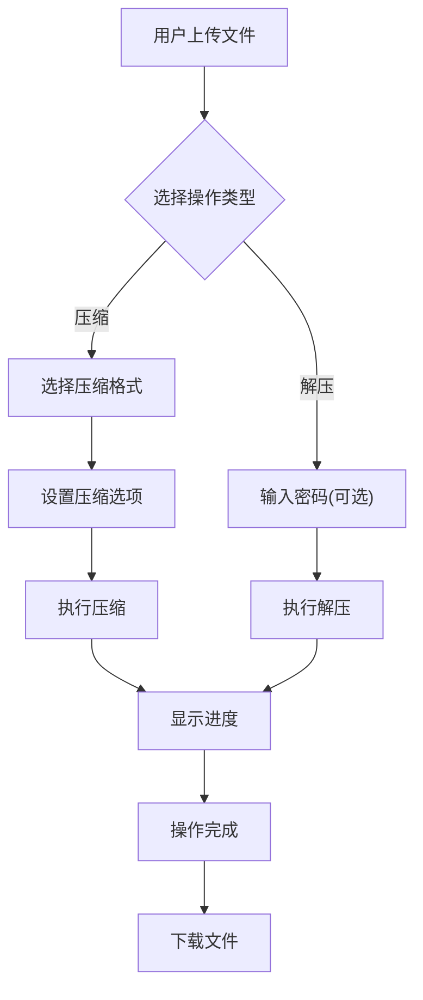

## 1. 产品概述
OpenBlackZip是一款基于7zip的现代化网页压缩软件，提供精美界面和完整的压缩/解压功能。

- **主要用途**: 提供在线文件压缩和解压服务，支持多种压缩格式
- **目标用户**: 需要处理压缩文件的普通用户和专业人士
- **市场价值**: 提供跨平台、无安装的压缩工具体验

## 2. 核心功能

### 2.1 用户角色
| 角色 | 权限 |
|------|------|
| 普通用户 | 压缩文件、解压文件、查看文件列表 |

### 2.2 功能模块
1. **首页/主界面**: 文件上传区域、压缩操作区、解压操作区、文件列表
2. **压缩模块**: 选择文件、设置压缩格式、设置密码、执行压缩
3. **解压模块**: 上传压缩包、选择解压路径、输入密码、执行解压
4. **文件管理**: 查看上传文件、删除文件、下载文件

### 2.3 页面详情
| 页面名称 | 模块名称 | 功能描述 |
|----------|----------|----------|
| 首页 | 文件上传区 | 拖拽上传文件、点击选择文件 |
| 首页 | 压缩操作区 | 选择压缩格式、设置密码、压缩级别 |
| 首页 | 解压操作区 | 上传压缩包、输入密码、解压选项 |
| 首页 | 文件列表 | 显示已上传文件、支持删除和下载 |
| 首页 | 进度面板 | 显示压缩/解压进度和状态 |

## 3. 核心流程

### 压缩流程
用户上传文件 → 选择压缩格式 → 设置选项 → 点击压缩 → 显示进度 → 下载压缩包

### 解压流程
用户上传压缩包 → 输入密码（可选） → 点击解压 → 显示进度 → 查看解压文件 → 下载文件

## 4. 用户界面设计

### 4.1 设计风格
- **主色调**: 深色主题，使用深邃的背景配合霓虹色彩点缀
- **次要颜色**: 紫色、青色作为强调色
- **按钮风格**: 圆角、渐变效果、悬停动画
- **字体**: 使用现代无衬线字体，标题使用较粗的字重
- **布局风格**: 卡片式布局，左侧操作区，右侧文件列表
- **图标**: 使用 lucide-react 图标库

### 4.2 页面设计概述
| 页面名称 | 模块名称 | UI元素 |
|----------|----------|--------|
| 首页 | 文件上传区 | 大区域拖拽上传、虚线边框、图标提示、悬停变色 |
| 首页 | 操作按钮 | 渐变背景、圆角设计、点击反馈、状态显示 |
| 首页 | 文件列表 | 卡片展示、文件图标、大小显示、操作按钮组 |
| 首页 | 进度面板 | 进度条动画、百分比显示、状态文字、取消按钮 |

### 4.3 响应式设计
- 桌面端：完整双栏布局
- 平板端：自适应单栏布局
- 移动端：紧凑布局，操作按钮垂直排列

### 4.4 动效设计
- 文件上传动画
- 进度条动画
- 按钮悬停效果
- 文件列表淡入效果
- 操作完成提示动画