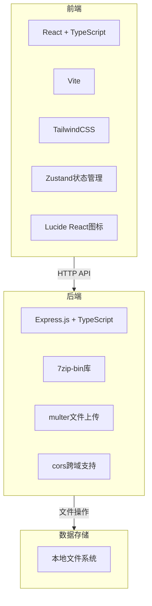

## 1. 架构设计



## 2. 技术描述

- **前端**: React@18 + TypeScript + TailwindCSS@3 + Vite
- **状态管理**: Zustand
- **图标库**: lucide-react
- **后端**: Express.js + TypeScript
- **压缩工具**: 7zip-bin + node-7z
- **文件上传**: multer
- **跨域**: cors
- **数据库**: 无需数据库，使用文件系统存储

## 3. 路由定义

### 前端路由
| 路由 | 用途 |
|------|------|
| / | 首页，包含压缩和解压功能 |

### 后端路由
| 路由 | 方法 | 用途 |
|------|------|------|
| /api/upload | POST | 上传文件 |
| /api/compress | POST | 压缩文件 |
| /api/extract | POST | 解压文件 |
| /api/files | GET | 获取文件列表 |
| /api/files/:id | DELETE | 删除文件 |
| /api/download/:filename | GET | 下载文件 |

## 4. API定义

### 4.1 上传文件
- **路径**: POST /api/upload
- **请求**: multipart/form-data
- **响应**: 
```typescript
{
  success: boolean;
  filename: string;
  size: number;
  path: string;
}
```

### 4.2 压缩文件
- **路径**: POST /api/compress
- **请求**: 
```typescript
{
  files: string[];
  format: 'zip' | '7z' | 'tar' | 'gz';
  password?: string;
  level?: number;
}
```
- **响应**: 
```typescript
{
  success: boolean;
  outputPath: string;
  outputFilename: string;
  originalSize: number;
  compressedSize: number;
}
```

### 4.3 解压文件
- **路径**: POST /api/extract
- **请求**: 
```typescript
{
  filename: string;
  password?: string;
}
```
- **响应**: 
```typescript
{
  success: boolean;
  files: string[];
}
```

### 4.4 获取文件列表
- **路径**: GET /api/files
- **响应**: 
```typescript
{
  files: Array<{
    name: string;
    size: number;
    type: 'file' | 'folder';
    extension: string;
    createdAt: Date;
  }>;
}
```

### 4.5 删除文件
- **路径**: DELETE /api/files/:filename
- **响应**: 
```typescript
{
  success: boolean;
}
```

### 4.6 下载文件
- **路径**: GET /api/download/:filename
- **响应**: 文件流

## 5. 项目结构

```
/workspace
├── src/                      # 前端代码
│   ├── components/           # 组件目录
│   │   ├── UploadZone.tsx    # 文件上传区域
│   │   ├── CompressPanel.tsx # 压缩操作面板
│   │   ├── ExtractPanel.tsx  # 解压操作面板
│   │   ├── FileList.tsx      # 文件列表
│   │   ├── ProgressBar.tsx   # 进度条组件
│   │   └── Header.tsx        # 页面头部
│   ├── hooks/                # 自定义hooks
│   │   └── useCompression.ts # 压缩操作hook
│   ├── store/                # Zustand状态管理
│   │   └── store.ts          # 全局状态
│   ├── types/                # TypeScript类型定义
│   │   └── index.ts          # 类型定义
│   ├── utils/                # 工具函数
│   │   └── api.ts            # API调用封装
│   ├── App.tsx               # 主应用组件
│   ├── main.tsx              # 入口文件
│   └── index.css             # 全局样式
├── api/                      # 后端代码
│   ├── src/
│   │   ├── controllers/      # 控制器
│   │   │   ├── upload.ts     # 上传控制器
│   │   │   ├── compress.ts   # 压缩控制器
│   │   │   ├── extract.ts    # 解压控制器
│   │   │   └── files.ts      # 文件管理控制器
│   │   ├── routes/           # 路由定义
│   │   │   └── index.ts      # 路由入口
│   │   ├── utils/            # 工具函数
│   │   │   └── sevenZip.ts   # 7zip操作封装
│   │   └── server.ts         # 服务器入口
│   └── dist/                 # 编译输出
├── uploads/                  # 文件上传目录
├── package.json              # 项目依赖
├── tsconfig.json             # TypeScript配置
├── vite.config.ts            # Vite配置
├── tailwind.config.js        # TailwindCSS配置
└── postcss.config.js         # PostCSS配置
```

## 6. 核心依赖

| 依赖 | 版本 | 用途 |
|------|------|------|
| react | ^18.2.0 | 前端框架 |
| react-dom | ^18.2.0 | React DOM操作 |
| typescript | ^5.3.0 | TypeScript支持 |
| vite | ^5.0.0 | 构建工具 |
| tailwindcss | ^3.4.0 | CSS框架 |
| zustand | ^4.4.0 | 状态管理 |
| lucide-react | ^0.290.0 | 图标库 |
| express | ^4.18.0 | 后端框架 |
| multer | ^1.4.0 | 文件上传处理 |
| cors | ^2.8.0 | 跨域支持 |
| 7zip-bin | ^5.1.0 | 7zip二进制文件 |
| node-7z | ^3.0.0 | 7zip Node.js封装 |